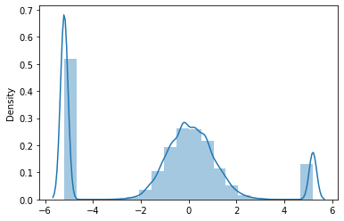

# OnlineNewsPopularity Data
  
## Summary

In this task, we predict the value of the shares column by pre-processing the data and checking different machine-learning models.

#### Model results with R2_score and training with linear regression without any preprocessing: 0.013436911487878178

#### Model results with R2_score and training with polynomial regression by preprocessing: 0.42482892634462005

## Checking correlation

  

    
  

    
It can be seen that most of the features are not related to the target.

Therefore, it is not possible to remove a feature easily, because it is possible that some features have a non-linear relationship with the target, and also because the coefficients are very close to each other.

So, removing features in relation to their relationship with the target is not a good thing.

## Checking the distribution of shares

  

    
  

## Remove outlier records

### IQR :

Due to the deletion of a large part of the data, we abandon this method.

### Z-test :

Due to the non-normality of the distribution, we refrain from using this method.

### Percentile:

By removing one percentage of outlier data :‌

  

    
  

## Scaling

  -  _Quantile Transformer_
  
  

    
  

  - _power transformer_
    

      
    

  
  - -min-max-
    

      
    

    

## Again scaling

Now we rescale the data that we scaled with the Quantile Transformer method

- __**min-mix**__

    

      
    

    

A very important point is that all data are normally between 0 and 1.

- __**power transformer**__

    

      
    

    
- __**RobustScaler**__

    

      
    

    
   
    
- __**StandardScaler**__

    

      
    

    
    
## using min-max after Quantile

  

    
  

## Linear model

R2_score : 0.15420224054686105

## Polynomial model

R2_score : 0.42482892634462005

    
